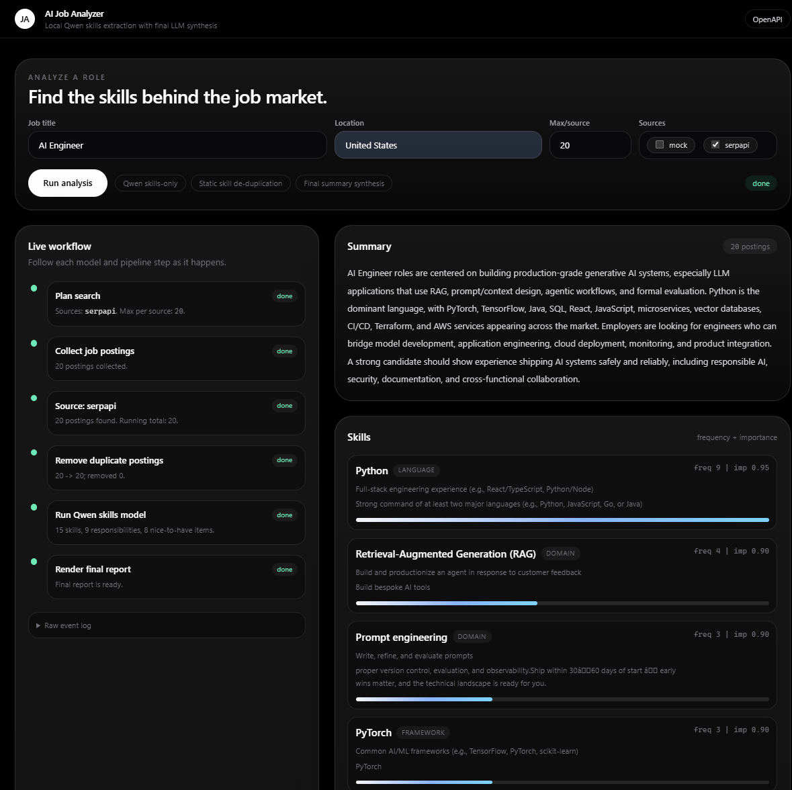

# AI Job Analyzer

Agentic workflow that, given a job title, scrapes matching postings from
multiple job boards and uses an LLM to extract the **key tech stack** and
**core competencies** required for the role.



> Companion doc: see [`AGENTS.md`](./AGENTS.md) for the living architecture
> notes, conventions, and roadmap.

## Status

**M1.12 in progress.** Single-page frontend at `/ui/` with a **live workflow
timeline** that streams every stage of the agent (plan → scrape per source
→ dedupe → extract → result) over Server-Sent Events. The noisy public/RSS
demo sources have been replaced with **SerpApi Google Jobs** as the API-backed
source. The LLM falls back to a safe mock when no API key is configured, so the
project still runs offline for mock-source demos.

The model-lab workflow now includes a generated SerpApi seed dataset, OpenAI
teacher labels, QLoRA training scripts, and a repeatable evaluation harness for
comparing pure Qwen, OpenAI baselines, and future QLoRA adapters on the same
held-out test split.

## Requirements

- Python `>=3.11,<3.14`
- [`uv`](https://docs.astral.sh/uv/) (`python -m pip install --user uv` if you
  don't have it).

## Quick start

```bash
# 1. Install deps (creates .venv automatically)
uv sync

# 2. (Optional) configure your environment
cp .env.example .env

# 3. Run the server
uv run ai-job-analyzer serve --reload
# -> open http://127.0.0.1:8000/        (frontend with live workflow timeline)
# -> open http://127.0.0.1:8000/docs    (OpenAPI / Swagger)

# 4. Or skip the UI and run a one-off analysis from the CLI
uv run ai-job-analyzer analyze "Senior ML Engineer" --source mock     # offline demo
uv run ai-job-analyzer analyze "Python Backend"     --source serpapi
```

To use a real LLM for the summary, set `LLM_PROVIDER=openai` and
`OPENAI_API_KEY=...` in `.env`. You can also run a local fine-tuned Qwen LoRA
model as a separate service with `LLM_PROVIDER=qwen_service`; see
[`model_lab/README.md`](model_lab/README.md). In hybrid mode, Qwen handles the
high-volume per-JD skill extraction while `FINALIZER_PROVIDER=openai` lets a
stronger OpenAI model canonicalize skill synonyms and write the final summary.
For small local Qwen adapters, `QWEN_EXTRACTION_TASK=skills_only` is the
recommended mode: Qwen extracts only `top_skills` from each JD, then the
finalizer synthesizes summary and responsibilities from aggregated skills plus
compact evidence candidates.
The current application-ready local model is:
`model_lab/models/qwen3-1_7b-skill-extractor-qlora-r16a32-skills-only`.
The application also applies the saved deterministic skill de-duplication layer
from `model_lab/data/skill_canonicalization/skill_canonicalization.mapping.json`
before any optional LLM finalizer cleanup.
Without a configured provider the pipeline silently falls back to a
keyword-frequency heuristic so analysis always returns something.

API sources require their own keys in `.env`: `SERPAPI_API_KEY`. Sources with
missing credentials are skipped safely.

## API endpoints

| Method | Path                | Purpose                                            |
| ------ | ------------------- | -------------------------------------------------- |
| GET    | `/`                 | Redirects to `/ui/`.                               |
| GET    | `/ui/`              | Single-page frontend (live workflow timeline).     |
| GET    | `/healthz`          | Liveness probe.                                    |
| GET    | `/sources`          | List of registered scrapers.                       |
| POST   | `/analyze`          | Run the workflow, return final `AnalysisResult`.   |
| POST   | `/analyze/stream`   | Same workflow, **streamed as Server-Sent Events**. |

## Project layout

```
src/ai_job_analyzer/
├── api/          # FastAPI app + routes (incl. SSE) + /ui mount
├── agents/       # Agentic workflow as an async-generator of WorkflowEvents
├── scrapers/     # JobScraper interface + mock + real sources (registry-based)
├── extractors/   # LLM (langchain) + heuristic mock extractors
├── models/       # Pydantic schemas shared across layers
├── core/         # Settings + logging + on-disk cache
└── cli.py        # `ai-job-analyzer` entry point (typer)
frontend/
└── index.html    # Single-file UI (Tailwind CDN, vanilla JS, SSE consumer)
tests/            # pytest: smoke + scraper + extractor + stream coverage
```

## Development

```bash
uv sync --group dev
uv run pytest
uv run ruff check .
uv run ruff format .
uv run mypy src

# optional local Qwen LoRA training/inference stack
uv sync --extra qwen-lora
uv run ai-job-analyzer serve-qwen

# optional hybrid app mode (requires OPENAI_API_KEY)
LLM_PROVIDER=qwen_service FINALIZER_PROVIDER=openai uv run ai-job-analyzer serve --reload
```

To run the app with the latest trained local Qwen adapter, configure:

```bash
QWEN_BASE_MODEL=Qwen/Qwen3-1.7B
QWEN_ADAPTER_PATH=model_lab/models/qwen3-1_7b-skill-extractor-qlora-r16a32-skills-only
QWEN_EXTRACTION_TASK=skills_only
QWEN_MAX_NEW_TOKENS=1200
SKILL_CANONICALIZATION_MAPPING_PATH=model_lab/data/skill_canonicalization/skill_canonicalization.mapping.json
```

Then start the Qwen model service and the main app:

```bash
uv run ai-job-analyzer serve-qwen
LLM_PROVIDER=qwen_service FINALIZER_PROVIDER=openai uv run ai-job-analyzer serve --reload
```

`FINALIZER_PROVIDER=openai` gives the best final summary/responsibility text
when an OpenAI key is configured. Use `FINALIZER_PROVIDER=qwen_service` for a
fully local run.

Qwen fine-tuning defaults to `Qwen/Qwen3-1.7B`. To generate supervised training
labels, first collect unlabeled seed postings:

```bash
uv run python model_lab/scripts/collect_qwen_seed_postings.py \
  --output model_lab/data/qwen_skill_seed.generated.jsonl \
  --source serpapi \
  --per-role 100
```

Then label them with the closed-source OpenAI teacher model:

```bash
uv run python model_lab/scripts/generate_qwen_training_data.py \
  --input model_lab/data/qwen_skill_seed.generated.jsonl \
  --output model_lab/data/qwen_skill_train.generated.jsonl \
  --model gpt-5.2
```

Then fine-tune with QLoRA:

```bash
uv run python model_lab/scripts/finetune_qwen_lora.py \
  --train model_lab/data/qwen_skill_train.generated.jsonl \
  --output model_lab/models/qwen-job-keyword-lora
```

For the current small-model path, train a skills-only adapter on canonicalized
labels:

```bash
uv run python model_lab/scripts/finetune_qwen_lora.py \
  --train model_lab/data/canonicalized/eval/train.jsonl \
  --output model_lab/models/qwen3-1_7b-skill-extractor-qlora-r16a32-skills-only \
  --base-model Qwen/Qwen3-1.7B \
  --task skills_only \
  --max-skills 20 \
  --evidence-per-skill 1
```

To prove QLoRA helps, use the model-lab eval harness to compare pure
`Qwen/Qwen3-1.7B`, `gpt-5-mini`, and later your QLoRA adapter on the same test
split:

```bash
uv run python model_lab/scripts/split_qwen_dataset.py
uv run python model_lab/scripts/evaluate_skill_extractors.py --provider openai --openai-model gpt-5-mini --run-name gpt-5-mini
uv run python model_lab/scripts/render_eval_report.py model_lab/eval_runs/*.metrics.json --output model_lab/eval_runs/report.html
```

### QLoRA Evaluation Results

The current held-out test split contains 299 labeled job postings. Metrics below
compare model-predicted `top_skills` against OpenAI teacher labels. Precision,
recall, and F1 use normalized skill-name overlap, so they are intentionally
strict and do not count semantic near-matches unless they normalize to the same
key. `faithfulness_proxy` is a lightweight evidence-support check: it counts
predicted skills whose name or evidence snippet is supported by the posting
text.

| Run | Model | Successful samples | Failures | Skill precision | Skill recall | Skill F1 | Faithfulness proxy | Predicted skills |
| --- | --- | ---: | ---: | ---: | ---: | ---: | ---: | ---: |
| `qwen3-1_7b-base` | `Qwen/Qwen3-1.7B` | 295 / 299 | 4 | 0.324 | 0.171 | 0.224 | 0.997 | 1,930 |
| `gpt-5-mini` | `gpt-5-mini` | 299 / 299 | 0 | 0.326 | 0.342 | 0.334 | 0.982 | 3,902 |
| `qwen3-1_7b-qlora-r16a32-compact` | `Qwen/Qwen3-1.7B + QLoRA` | 275 / 299 | 24 | 0.409 | 0.235 | 0.299 | 0.999 | 1,959 |
| `qwen3-1_7b-qlora-r16a32-skills-only` | `Qwen/Qwen3-1.7B + skills-only QLoRA` | 297 / 299 | 2 | 0.416 | 0.251 | 0.313 | 1.000 | 2,232 |

Interpretation: pure Qwen3-1.7B is conservative and highly faithful, but it
misses many teacher-labeled skills, which lowers recall and F1. GPT-5 mini is
more complete and structurally stable, with roughly double the extracted skill
coverage and zero failures. This gives the QLoRA experiment a clear target:
increase Qwen recall/F1 while preserving high faithfulness and a low failure
rate.

The compact QLoRA adapter improves Qwen's skill precision, recall, and F1 over
the base 1.7B model while preserving very high evidence faithfulness. However,
it also raises the strict-schema failure rate to 24 / 299 samples because some
full structured outputs are still malformed. This suggests the 1.7B model is a
better fit for a narrower skills-only extractor, with summary and responsibility
synthesis handled by a stronger finalizer.

The skills-only QLoRA adapter keeps the same scoring standard but narrows the
generation task to `top_skills` only. It improves strict F1 over both Qwen
baselines and reduces the failure rate to 2 / 299. In the application, summary
and responsibility fields are generated later by the configured finalizer from
aggregated skills plus compact responsibility/nice-to-have candidates.

Headline result: the latest skills-only QLoRA adapter is the best local Qwen
run so far. It raises raw strict F1 from `0.224` to `0.313` over base Qwen,
raises semantic F1 from `0.310` to `0.414`, and keeps evidence faithfulness at
approximately `1.000`. GPT-5 mini remains stronger overall because its recall
is much higher, but the QLoRA experiment shows a clear, measurable local-model
improvement.

To reduce duplicate skill entities across jobs and models, run the global
canonicalization pass:

```bash
uv run python model_lab/scripts/canonicalize_skill_names.py
```

This writes one reusable mapping to
`model_lab/data/skill_canonicalization/skill_canonicalization.mapping.json` and
canonicalized copies under `model_lab/data/canonicalized/` and
`model_lab/eval_runs/canonicalized/`. Using this conservative shared mapping,
the GPT-5 mini strict-match F1 rises from `0.334` to `0.380`, and the compact
QLoRA F1 rises from `0.299` to `0.320`. The skills-only QLoRA adapter reaches
`0.342` canonicalized strict F1 with the same shared mapping.

For a fairer semantic score, run the cached LLM-as-judge evaluator:

```bash
uv run python model_lab/scripts/evaluate_semantic_skill_matches.py \
  model_lab/eval_runs/canonicalized/qwen3-1_7b-base.predictions.jsonl \
  model_lab/eval_runs/canonicalized/gpt-5-mini.predictions.jsonl \
  model_lab/eval_runs/canonicalized/qwen3-1_7b-qlora-r16a32-compact.predictions.jsonl \
  model_lab/eval_runs/canonicalized/qwen3-1_7b-qlora-r16a32-skills-only.predictions.jsonl
```

The judge only reviews plausible unmatched skill pairs and stores decisions in
`model_lab/data/skill_canonicalization/semantic_match_judgments.jsonl`. With
`gpt-5-mini` as the cached semantic judge, the current held-out results are:

| Run | Semantic precision | Semantic recall | Semantic F1 | Exact F1 before semantic judge |
| --- | ---: | ---: | ---: | ---: |
| `qwen3-1_7b-base-semantic` | 0.449 | 0.236 | 0.310 | 0.245 |
| `gpt-5-mini-semantic` | 0.559 | 0.587 | 0.572 | 0.380 |
| `qwen3-1_7b-qlora-r16a32-compact-semantic` | 0.538 | 0.309 | 0.392 | 0.320 |
| `qwen3-1_7b-qlora-r16a32-skills-only-semantic` | 0.549 | 0.332 | 0.414 | 0.342 |

For a local visual report after running the evaluation commands, open
`model_lab/eval_runs/report.html`. For the canonicalized strict report, open
`model_lab/eval_runs/canonicalized/report.html`. For the semantic judge report,
open `model_lab/eval_runs/semantic/report.html`.

## License

[MIT](./LICENSE)
